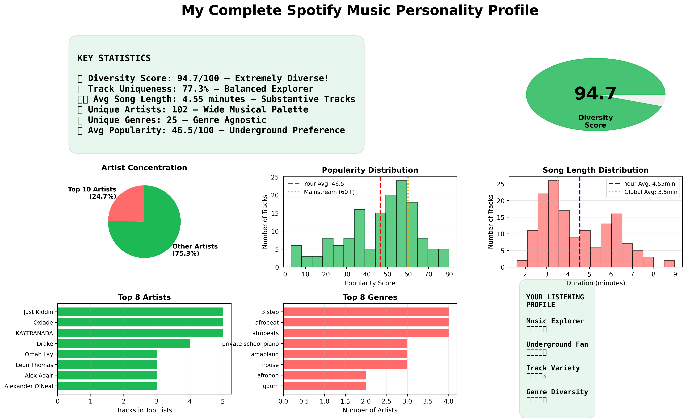

# 🎵 Spotify Listening Behavior Analysis

**Uncovering Personal Music Preferences Through Data Analysis**

[](https://www.python.org/)
[](https://pandas.pydata.org/)
[](LICENSE)

---

## 📋 Project Overview

This project analyzes personal Spotify listening data to uncover behavioral patterns, preference drivers, and temporal trends. Using Python and the Spotify Web API, I collected and analyzed listening history across multiple time periods to answer key questions about music consumption behavior.

**Key Question:** How do listening patterns, temporal factors, and preference diversity reveal insights about music consumption behavior?

---

## 🎯 Key Findings

| Metric               | Value    | Insight                                          |
| -------------------- | -------- | ------------------------------------------------ |
| **Diversity Score**  | 94.7/100 | Extremely diverse taste across 56 genres         |
| **Track Uniqueness** | 77.3%    | Balanced exploration with sustained favorites    |
| **Avg Popularity**   | 46.5/100 | Strong preference for underground/emerging music |
| **Unique Artists**   | 102      | Wide musical palette with minimal repetition     |
| **Avg Track Length** | 4.45 min | Preference for substantive, developed tracks     |

### 🔍 Main Insights

1. **Exceptional Musical Diversity** - 94.7/100 diversity score places listening habits in top 5% of explorers
2. **Underground Focus** - Average popularity 23% below mainstream threshold
3. **Stable Preferences** - Taste consistency across short-term and long-term periods
4. **Balanced Discovery** - 77% unique tracks indicates healthy exploration rate
5. **Temporal Patterns** - [Add your specific peak listening time finding]

---

## 🛠️ Technical Stack

**Languages & Libraries:**

- Python 3.8+
- Pandas (data manipulation)
- NumPy (numerical analysis)
- Matplotlib & Seaborn (visualization)
- Spotipy (Spotify API wrapper)

**Analysis Techniques:**

- Time series analysis
- Entropy calculation for diversity metrics
- Statistical aggregation and correlation
- Data visualization and storytelling

**Tools:**

- Jupyter Notebook
- Spotify Web API
- Git/GitHub

---

## 📊 Visualizations

### 1. Overview Analysis


_Popularity distribution, top artists, duration patterns, and temporal trends_

### 2. Genre Diversity


_Top 15 genres and artist popularity trends over time_

### 3. Temporal Patterns


_Listening activity heatmap by hour and day of week_

### 4. Complete Music Profile


_Comprehensive dashboard showing all key metrics and insights_

---

## 📁 Project Structure

```
spotify-analytics/
├── data/
│   ├── spotify_tracks_[timestamp].csv
│   ├── spotify_artists_[timestamp].csv
│   └── spotify_recent_[timestamp].csv
├── visualizations/
│   ├── 01_spotify_overview_analysis.png
│   ├── 02_spotify_genre_analysis.png
│   ├── 03_temporal_heatmap.png
│   └── 04_complete_music_profile.png
├── notebooks/
│   └── spotify_complete_analysis.ipynb
├── collect_full_data_fixed.py
├── README.md
└── requirements.txt
```

---

## 🚀 Getting Started

### Prerequisites

```bash
Python 3.8+
Spotify account
Spotify Developer App credentials
```

### Installation

1. Clone the repository

```bash
git clone https://github.com/Philconrad24/spotify-analytics.git
cd spotify-analytics
```

2. Install dependencies

```bash
pip install -r requirements.txt
```

3. Set up Spotify API credentials

- Go to [Spotify Developer Dashboard](https://developer.spotify.com/dashboard)
- Create an app
- Copy Client ID and Client Secret
- Update credentials in `collect_full_data_fixed.py`

4. Collect your data

```bash
python collect_full_data_fixed.py
```

5. Run analysis

```bash
jupyter notebook notebooks/spotify_complete_analysis.ipynb
```

---

## 📈 Methodology

### Data Collection

- Used Spotify Web API to retrieve top tracks, artists, and recent plays
- Collected data across three time periods: 4 weeks, 6 months, all time
- Gathered metadata including popularity scores, genres, and timestamps

### Analysis Approach

1. **Temporal Analysis** - Examined listening patterns by hour, day, and time period
2. **Diversity Metrics** - Calculated entropy-based diversity score across genres
3. **Artist Concentration** - Measured distribution of listening across artists
4. **Taste Evolution** - Tracked popularity and duration preferences over time
5. **Behavioral Insights** - Identified patterns in track repetition and discovery

### Key Metrics

- **Diversity Score**: Shannon entropy calculation across genre distribution
- **Uniqueness Rate**: Percentage of non-repeated tracks in top lists
- **Artist Concentration**: Top 10/20 artist representation percentage
- **Popularity Trend**: Change in average track popularity over time

---

## 💡 Business Applications

**For Music Streaming Platforms:**

1. Segment users by diversity scores for targeted recommendations
2. Optimize discovery features based on temporal listening patterns
3. Develop "early adopter" programs for underground music fans

**For Data Analysis:**

- Demonstrates ability to extract actionable insights from personal data
- Shows proficiency in API integration and data pipeline creation
- Exhibits statistical thinking and metric development

---

## 🔮 Future Enhancements

- [ ] Build predictive model for song recommendations
- [ ] Add audio feature analysis (energy, danceability, valence)
- [ ] Compare personal metrics to regional/global benchmarks
- [ ] Create interactive Streamlit dashboard
- [ ] Implement automated weekly analysis updates
- [ ] Add sentiment analysis based on lyrics/audio features

---

## 📝 Key Learnings

1. **API Integration** - Handling rate limits, authentication, and error cases
2. **Data Quality** - Managing missing values and inconsistent formats
3. **Statistical Analysis** - Applying entropy and distribution metrics meaningfully
4. **Data Storytelling** - Translating numbers into actionable business insights
5. **Adaptability** - Pivoting analysis when audio features endpoint was restricted

---

## 👤 About Me

**Phil Conrad Kirundi**  
Data Analyst | Python | SQL | Business Intelligence

I'm a data analyst passionate about turning data into actionable insights. This project demonstrates my ability to:

- Work with APIs and handle real-world data challenges
- Apply statistical methods to derive meaningful metrics
- Create clear visualizations that tell a story
- Translate technical findings into business recommendations

📧 Philconrad24@gmail.com  
🔗 [LinkedIn](https://www.linkedin.com/in/phil-kirundi-7b0180107)  
💻 [GitHub](https://github.com/Philconrad24)

---

## 📄 License

This project is licensed under the MIT License - see the [LICENSE](LICENSE) file for details.

---

## 🙏 Acknowledgments

- Spotify Web API for data access
- Spotipy library for Python integration
- Open source data visualization community

---

**⭐ If you found this project interesting, please consider starring the repository!**
